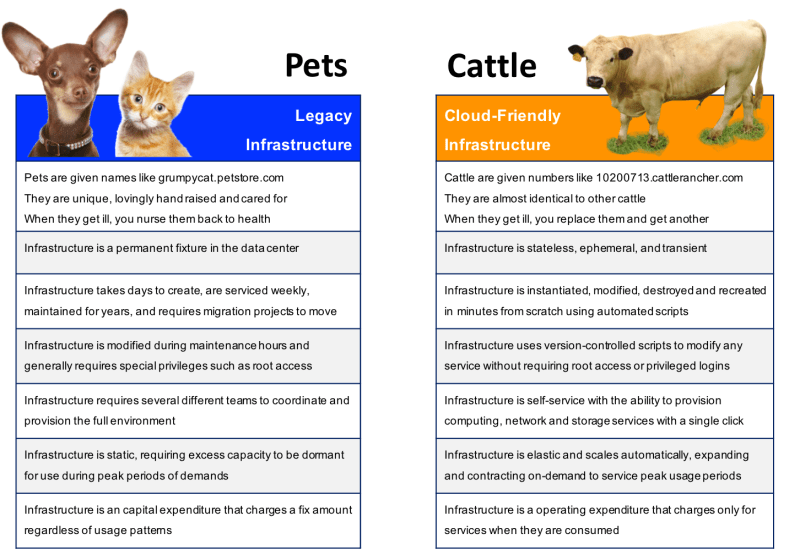
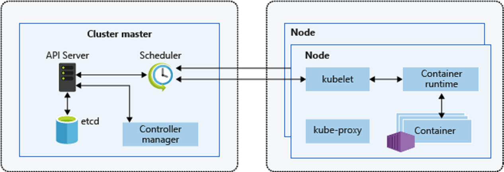
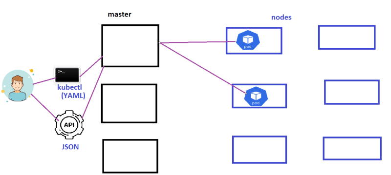
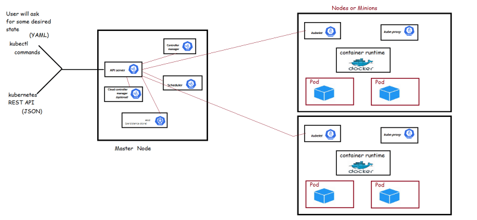
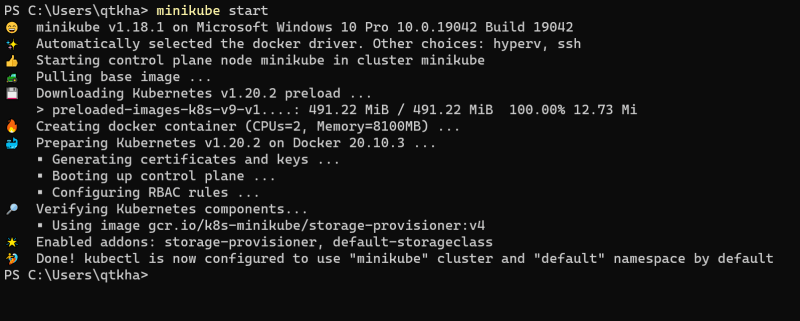
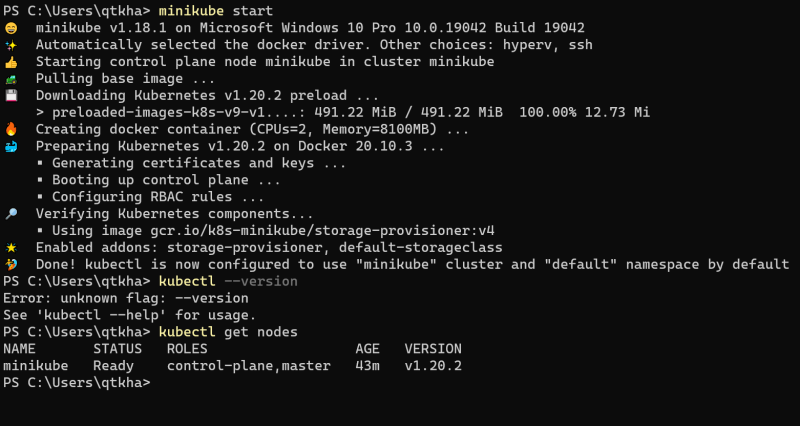
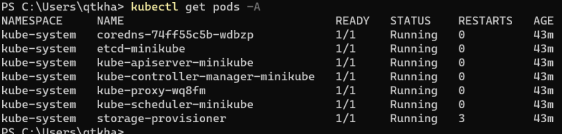

### Kubernetes (k8s)

* k8s is a portable, extensible, opensource platform for managing containerized workloads and services.
* It facilitates both declarative configuration and automation
* k8s provides
    * Service discovery and load balancing
    * Storage Orchestration
    * Automated rollouts and rollbacks
    * Automatic bin packing
    * Self healing
    * Secret and configuration management
* Kubernetes is very popular container orchestration platform
* To know more about kubernetes [Refer Here](https://kubernetes.io/docs/home/)
* All major cloud providers such as AWS, GCP, Azure have native kubernetes support
* Cattle vs Pets [Refer Here](https://joachim8675309.medium.com/devops-concepts-pets-vs-cattle-2380b5aab313)



* [Refer Here](https://kubernetes.io/docs/concepts/overview/components/) for official documentation on kubernetes components
* Basic components of k8s

* k8s cluster communication




## Installing Kubernetes
* K8s can be installed on a single node to set up the developer environments.
minikube
* On production environments we would be using a multi node setup
* For IOT / ARM processers => K3s (Lightweight kuberenetes)
* Kubeadmin (multi node setup on linux workloads)
* Kops [Refer Here](https://kubernetes.io/docs/setup/production-environment/tools/kops/) for installing k8s on AWS
* kubespray [Refer Here](https://kubernetes.io/docs/setup/production-environment/tools/kubespray/)
* Native Kubernetes on Cloud
    * AKS (Azure Kubernetes Services)
    * GKE (Google Kubernetes Engine)
    * EKS (Elastic Kubernetes Services on AWS)
* Lets try to setup
    * minikube
    * kubeadm

## Minikube
* This is a tool to set up a single node cluster and suitable for local environments.
* To setup minikube [Refer Here](https://minikube.sigs.k8s.io/docs/start/)
Commands

```
choco install minikube -y
minikube start
```


* Check the nodes


* Check all the pods

