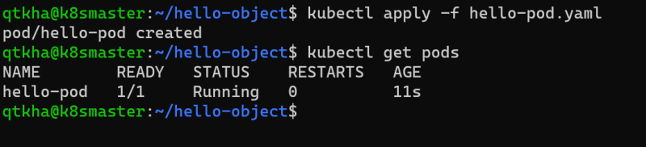
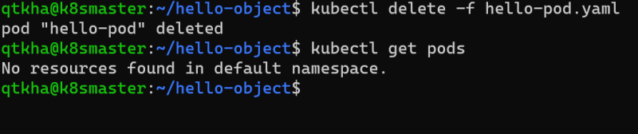
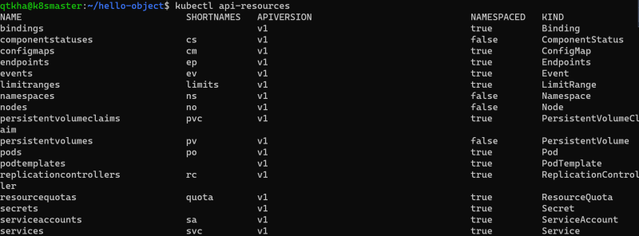
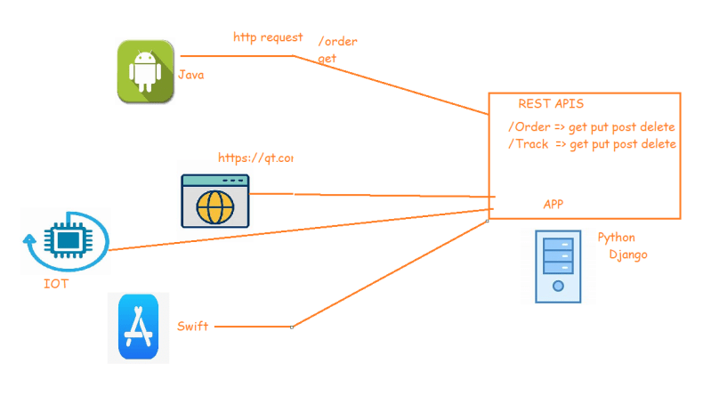
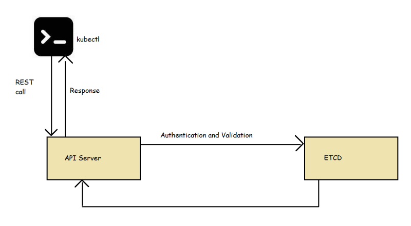
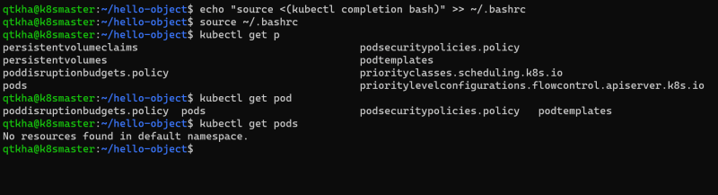
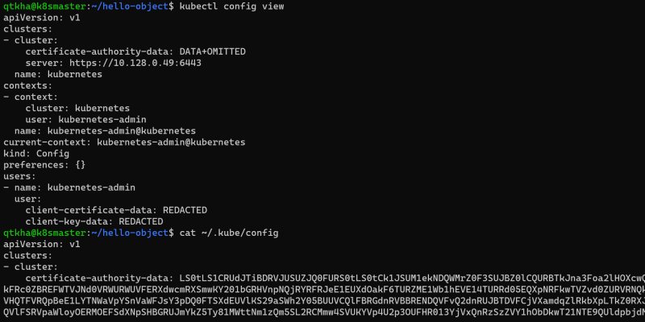

### Kubernetes Objects
* K8s objects are persistent entities of k8s system
* k8s object is "record of intent".
* Every k8s object will have an Object Specification (Spec) and object status
* The specificiation is about what we want and is regarded as desired state and the status is what is the actual state of object in k8s
* We specify object spec in the format of .yaml files and we get the status back after we apply the spec
* Lets take an example of the Pod spec

```yaml
---
apiVersion: v1
kind: Pod
metadata:
  name: hello-pod
  labels:
    app: hello-pod
spec:
  containers:
    - name: web
      image: httpd
      ports:
        - name: web
          containerPort: 80
          protocol: TCP
```
* Now apply the spec using ``` kubectl apply -f ``` and view the status of the object



* Now delete the spec using ``` kubectl delete -f ```



## Kubernetes API
* The core of the k8s control plane is the Api Server. This API server exposes HTTP API that lets enduser, different parts of your cluster and external components communicate with one another
* K8s stores the serialized state of objects by writing them to etcd
* To express the desired state we would be creating the specifications of the kubernetes resources
  * Pod
  * Container
  * Ephemeral Containers
  * Replication Controllers
  * Replica Sets
  * Deployments
  * StatefulSets
  * DaemonSet
  * Job
  * CronJob
  * HorizontalPodAutoScaler
* For the resources you can execute ``` kubectl api-resources ``` and then view the list of resources.
   * Resources will have api-version, kind, Namespaced and some of the resources will have shortnames

   

* To create this resources we will be using kubectl and specify the spec in yaml file and then apply



* API groups and versioning:
   * API Groups make it easier to extend the k8s api. The API group is specified in the REST path and in the apiVersion field of serialized object
   * There are several api groups
   * The core group is found at REST path /api/v1. This is simply written as v1
   * The named group: /api/$GROUP_NAME/$VERSION example: apiVersion: batch/v1
   * [Refer Here](https://kubernetes.io/docs/reference/generated/kubernetes-api/v1.20/#-strong-api-groups-strong-) for API Groups

## kubectl
* This is a command line utility for interacting and performing various operation on k8s.
* Kubectl has two ways of managing your cluster
   * imperative:
       * We create objects by executing kubectl commands
   * declarative:
       * We create objects by specifying the desired state as specification in YAML format

## HTTP Protocol and REST API



## How kubectl Communicates with k8s
* The API Server manages communications in k8s
* To achieve this , API-server implements the RESTful API over http and https to perform CRUD operations to populate and modify k8s API objects (pods, services, deployments)



## Kubectl cheatsheet
* [Refer Here](https://kubernetes.io/docs/reference/kubectl/cheatsheet/) for the official kubectl cheatsheet
* Now lets setup autocompletion



* kubectl configuration




