### Pod
* This is smallest deployable units of computing in k8s
* A Pod consists of one or more containers with shared network and storage resources
* Each Pod will recieve a unique ip address
* To create any object in k8s we need to create a template
* To write the spec navigate to api reference [Refer Here](https://kubernetes.io/docs/reference/generated/kubernetes-api/v1.19/)
* Checkout the pods specs created

```yaml
---
apiVersion: v1
kind: Pod
metadata:
  name: other-pod
spec: 
  containers:
    - name: httpd
      image: httpd
      ports:
        - containerPort: 80
    - name: mysql
      image: mysql:5.7
      ports:
        - containerPort: 3306
      env:
        - name: MYSQL_ROOT_PASSWORD
          value: 'qtadmin@123'
```
* Now lets try to apply the pod spec created

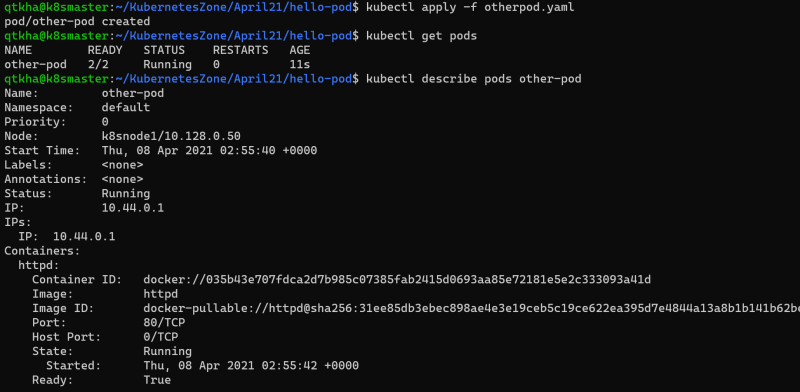

* Each pod will get one ip address

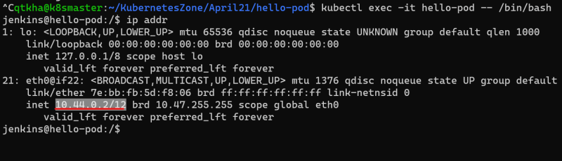

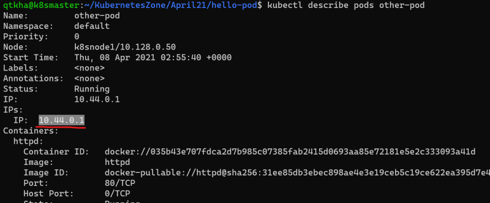

## Kubernetes namespace
* K8s supports multiple virtual cluster backed by same physical cluster and these virtual clusters are called as namespace
* In k8s for any object we have two kinds of scopes
    * cluster scope
    * namespace scope
* Commonly used kubectl commands
    * get object: In the resources which are scoped to namespace we can use -n to specify the namespace

``` kubectl get pods -n default ```

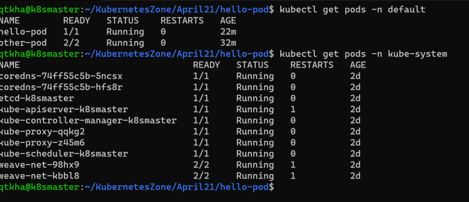

   * describe object-type object-name:

   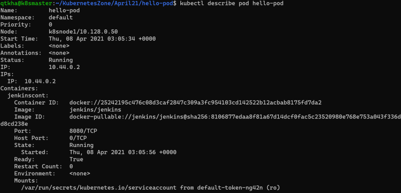

   * logs object-name:

   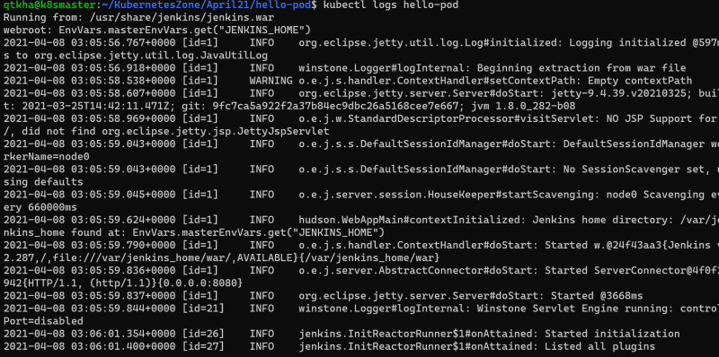

   * apply -f filename.yaml
   * Other Commands

   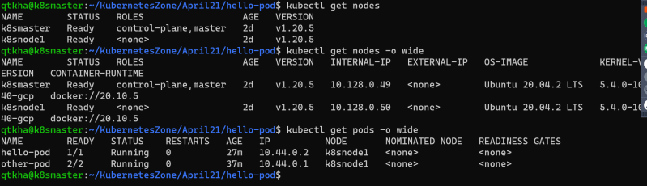

   * We can use short names

   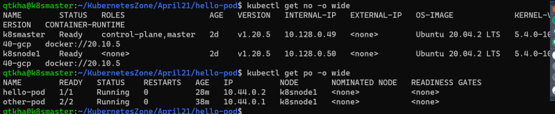

   * To get to know the information of cluster

   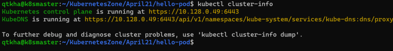

## Kubernetes HTTP Request Flow
* HTTP Request flow

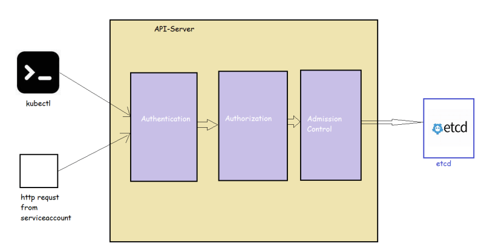

* Restful api [Refer Here](https://restfulapi.net/)

## The K8s API
* K8s api uses JSON over http for its requests and responses.
* k8s api allows clients to create, update, delete or read the description of object via standard http methods

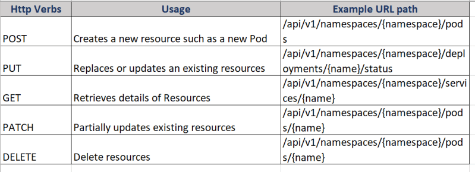


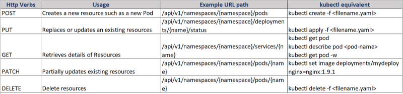


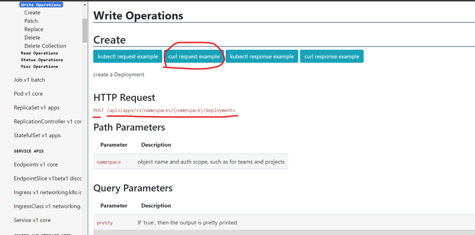


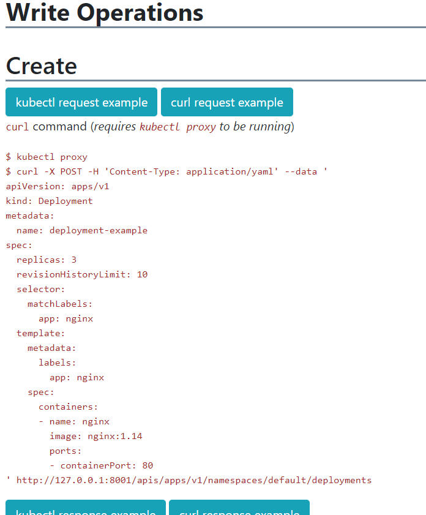


* Trace the HTTP requests: To trace http request we will be using kubectl get pods -n kube-system. To this we will be adding verbose level –v=8

``` kubectl get pods -n kube-system --v=8 ```


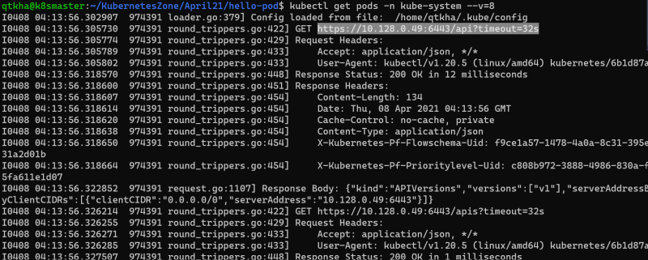
