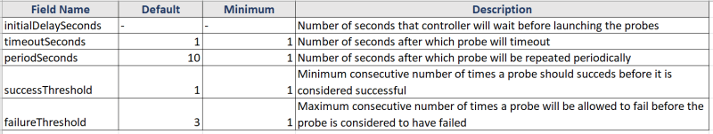

## Pods Contd
* kubectl port-forward was not working. To fix this we need to use the –address
* Hello pod yaml file 

```yaml
---
apiVersion: v1
kind: Pod
metadata: 
  name: hello-pod
spec:
  containers:
    - image: jenkins/jenkins
      name: jenkinscont
      ports:
        - containerPort: 8080
```

```
kubectl port-forward <pod-name> <portmapping> --address <private ip>
kubectl port-forward hello-pod 8081:8080 --address 10.128.0.49
```
* Our Pod configuration is divided into four components
    * __apiVersion__: version of k8s api
    * __kind__: This is kind of kubernetes object in our case it is Pod
    * __metadata__: metadata or information that uniquely identifies the object which we are creating
    * __spec__: Specification of our pod with container name image, volume and resource requests
* Lets create a namespace and run a pod within the namespace


* We can create using yaml file

```yaml
---
apiVersion: v1
kind: Pod
metadata: 
  name: namespace-demo
  namespace: dev
spec:
  containers:
    - image: jenkins/jenkins
      name: jenkinscont
      ports:
        - containerPort: 8080
```


* To change the default namespace to dev (or any other namespace)


## Scenario: Create a Pod running a Container with Resource Requirements
* Check the yaml syntax provided below.

```yaml
---
apiVersion: v1
kind: Pod
metadata:
  name: resource-requirements-demo
spec:
  containers:
    - name: container-with-limits
      image: nginx
      ports:
        - containerPort: 80
          protocol: TCP
      resources:
        limits:
          memory: "512M"
          cpu: "1"
        requests:
          memory: "64M"
          cpu: "0.5"
```


* Now lets try to add the resource request which are very much huge that we dont have any node suitable for the limits. 
* Check the yaml provided below.

```yaml
---
apiVersion: v1
kind: Pod
metadata:
  name: resource-requirements-demo
spec:
  containers:
    - name: container-with-limits
      image: nginx
      ports:
        - containerPort: 80
          protocol: TCP
      resources:
        limits:
          memory: "128G"
          cpu: "32"
        requests:
          memory: "64G"
          cpu: "16"
```

## Kubernetes Pod Lifecycle
* Pod can have the following states
    * Pending: This means the pod has been submitted to the cluster, but the controller hasn’t created all its containers yets. It may be downloading images or waiting for the pod to be scheduled on one of its cluster nodes
    * Running: This state means pod is assigned to one of the cluster nodes and at least one of the containers is either running or is in the process startup
    * Succeded: This state means the pods has run and all of the container have been terminated with success
    * Failed: This state means that the pod has run & atleast one of the containers has terminated with non-zero exit code (failure code)
    * unknown: This means theat the state of the pod could not be found

## Probes/Health Checks
* A probe is a health check that can be configured to check the health of containers running in a Pod. A probe may return the following results
  * Success
  * Failure
  * Unknown
* Types of Probe
    * Liveness Probe: This is used to determine if the particular container is running or not. If a container fails the liveness probe, the controller will try to restart the pod on the same node according to the restart policy configured for the pod
    * Readiness Probe: This is used to determine whether a particular container is ready to recieve requests or not. If this fails kubernetes controller will ensure that the pod doesn’t recieve any requests. If container specifies a readiness probe, its default state will be Failure until readiness probe succeds.
* Configuration of probes



* Implementation of Probes
    * Command Probe: In this probe controller will get the contaienr to execute specific command in order to perform probe on the container.
    * HTTP Request Probe: In this probe controller will send a GET HTTP request to the give address (host and port) to perform probe on the container. We can set the following fields to configure the HTTP Probe
       * host
       * path
       * port
       * httpHeaders
       * scheme:
    * TCP Socket Probe: In this probe, the controller will try to establish a connection on the given host and the specified port number. We can set the following fields for this probe
      * host
      * port
* RESTART policy:
   * We can specify restartPolicy in the pod specification to instruct controller about the conditions to restart the pod. The default value of restartPolicy is Always. The possible values are
     * Always: Always restart the pod when it terminates
     * OnFailure: Restart the pod only when it terminates with Failure
     * Never: Never restart the pod

## Scenario 1: Create a Pod running a container with a liveness probe and no restart policy
* Checkout the manifest file

```yaml
---
apiVersion: v1
kind: Pod
metadata:
  name: liveness-norestart
spec:
  restartPolicy: Never
  containers:
    - name: ubuntu-container
      image: ubuntu:latest
      command:
        - /bin/bash
        - -ec
        - touch /tmp/qt; sleep 30; rm /tmp/qt; sleep 600
      livenessProbe:
        exec:
          command:
            - cat
            - /tmp/qt
        initialDelaySeconds: 5
        periodSeconds: 5
```
* Create the pod


* Describe the pod


## Scenario 2: Create a pod running a conatiner with restartPolicy Always
* Checkout the yaml file

```yaml
apiVersion: v1
kind: Pod
metadata:
  name: liveness-norestart
spec:
  restartPolicy: Always
  containers:
    - name: ubuntu-container
      image: ubuntu:latest
      command:
        - /bin/bash
        - -ec
        - touch /tmp/qt; sleep 30; rm /tmp/qt; sleep 600
      livenessProbe:
        exec:
          command:
            - cat
            - /tmp/qt
        initialDelaySeconds: 5
        periodSeconds: 5
```


## Scenario 3: Create a pod running a container with Readiness Probe
* Checkout the yaml file

```yaml
---
apiVersion: v1
kind: Pod
metadata: 
  name: readiness-command-probe
spec:
  containers:
    - name: ubuntu-container
      image: ubuntu:latest
      command:
        - /bin/bash
        - -ec
        - sleep 30; touch /tmp/ready; sleep 600
      readinessProbe:
        exec:
          command:
            - cat
            - /tmp/ready
      initialDelaySeconds: 10
      periodSeconds: 5
```


## Scenario 4: Create a pod with http Probe for liveness and readiness
* Checkout manifest file provided below

```yaml
---
apiVersion: v1
kind: Pod
metadata: 
  name: http-probe-demo
spec:
  containers:
    - name: http-server
      image: httpd:latest
      ports:
        - containerPort: 80
          protocol: TCP
      livenessProbe:
        httpGet:
          port: 80
          path: /
        initialDelaySeconds: 10
        periodSeconds: 5
        successThreshold: 1
        failureThreshold: 1
```
* Apply the manifest and get pods info


* [Refer Here](https://kubernetes.io/docs/tasks/configure-pod-container/configure-liveness-readiness-startup-probes/) for the official docs on k8s probes
