## Labels and Annotations
* Labels are the metadata that contains identifiable information to the kubernetes objects. These are basically key-value pairs attached to the objects such as pods
* Each key must be unique for an object
* Labels would appear in metadata section and the yaml would appear as

```
metadata:
  labels:
    key1: value1
    key2: value2
```
* Constraints for Labels:
    * Label prefix: This is optional and this must be a DNS subdomain. This cannot be longer thatn 253 characters & cannot contain spaces. The label prefix is always followed by a forwar slash Eg: directdevops.blog/. If no prefix is used the label key is assumed to be private to the user. label prefixes specific to k8s core system kubernetes.io/ and k8s.io/
    * Label name: The label name is required and can be upto 63 characters long.
* Value of the key in k8s is label-prefix/label-name or label-name

## Scenario: Lets create a ngnix pod with labels organized by team/project
* Checkout the manifest file provided below.

```yaml
---
apiVersion: v1
kind: Pod
metadata:
  name: label-demo1
  labels:
    environment: developer
    team: infra-ops
    project: qt-ecommerce
spec:
  containers:
    - name: nginx-container
      image: nginx
      ports:
        - containerPort: 80
          protocol: TCP
```
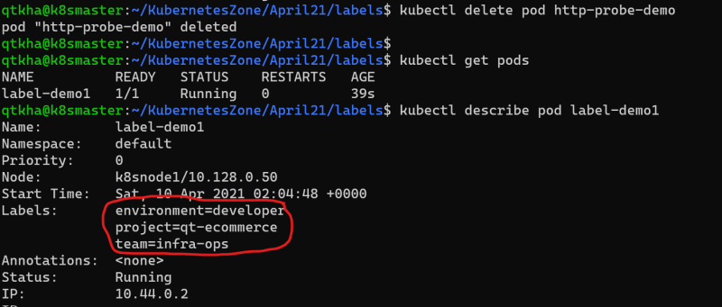

* Add labels to k8s object after creation


* To change the labels

```
kubectl label --overwrite pod label-demo1 server=nginx-webserver
```
* To Remove the label

```
kubectl label pod label-demo1 server-
```
## Selecting k8s objects using label selectors
* Lets create two more pod specs

```yaml
---
apiVersion: v1
kind: Pod
metadata:
  name: label-demo3
  labels:
    environment: qa
    team: sys-ops
    project: qt-elearn
spec:
  containers:
    - name: mysql-container
      image: mysql
      ports:
        - containerPort: 3306
          protocol: TCP
```
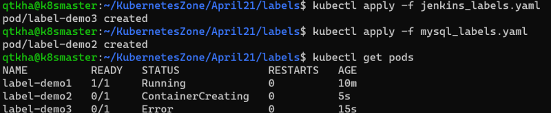

* We can query the objects using label selector

```
kubectl get pods -l {label-selector}
```
* There are two types of label selectors
    * equality based
    * set-based
* Equality based selectors:
    * In this selector we have three kinds of operators = == !=
    * Lets try to get all the pods with the label environment is equal to developer
    
    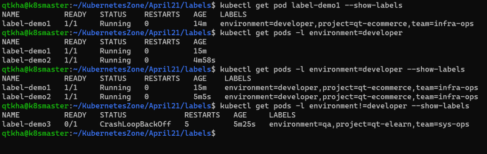

    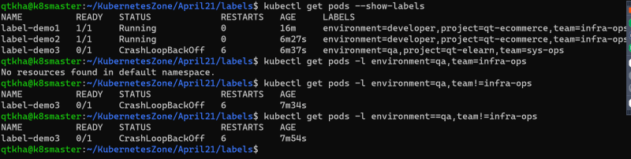
* SET-BASED Selectors
    * In this we have 3 kinds of operators in notin exists
    * Lets try some examples

    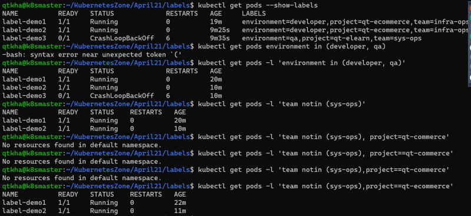

## Annotations
* Using labels we can add metadata which can be later used to filter/select objects
* Annotations on the other hand have fewer constraints, however we cannot filter or select objects by annotations
* Annotations are generally used by tools or users to get subjective information regarding k8s object.
* Check the manifest file provided below.

```yaml
---
apiVersion: v1
kind: Pod
metadata:
  name: label-demo1
  labels:
    environment: developer
    team: infra-ops
    project: qt-ecommerce
  annotations:
    commit-id: 3190dd9e231b92f07da29e052a0fbc812ed8c999
    jira-issue: "https://jira.qualtitythought.in/issue/OP-25"
spec:
  containers:
    - name: nginx-container
      image: nginx
      ports:
        - containerPort: 80
          protocol: TCP
```
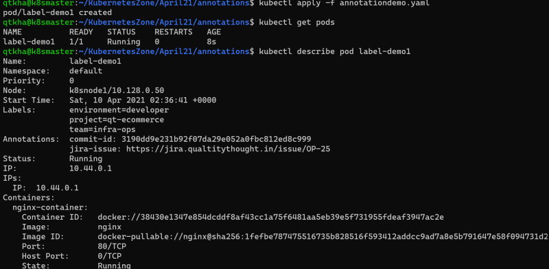

* Like what we have done in labels we can add/modify/delete annotations from kubectl

```
kubectl annotate pod <podname> <annotate_key>=<annotate_value>
kubectl annotate --overwrite pod <podname> <annotate_key>=<annotate_value>
kubectl annotate pod <podname> <annotate_key>-
```
## Kubernetes Controllers
* Pod is the workload in the k8s cluster
* When we deploy our application in production,
    * we might need more than one replica of pod
    * We can balance load across multiple pods so that one pod is not overloaded
* k8s supports different controllers that you can use for replications and maintaining state. The controllers we have are
    * ReplicaSets
    * Deployments
    * DaemonSets
    * StatefulSets
    * Jobs
* A controller is an object in k8s that ensures application runs in the desired state for its entire runtime

## ReplicaSet
* A ReplicaSet is a k8s controller that keeps a certain number of Pods running at any given time
* ReplicaSet acts a supervisor for multiple Pods across different nodes in a k8s cluster. A ReplicaSet will terminate or start new Pods to match the configuration specified in Replicaset Template.

```yaml
---
apiVersion: apps/v1
kind: ReplicaSet
metadata:
  name: httpd-rs
  labels:
    app: httpd
spec:
  minReadySeconds: 5
  replicas: 2
  selector:
    matchLabels:
      app: httpd
  template:
    metadata:
      labels:
        app: httpd
    spec:
      containers:
        - name: httpd-container
          image: nginx
          ports:
            - containerPort: 80
              protocol: TCP
          readinessProbe:
            httpGet: 
              path: /
              port: 80
            initialDelaySeconds: 1
            periodSeconds: 5
```
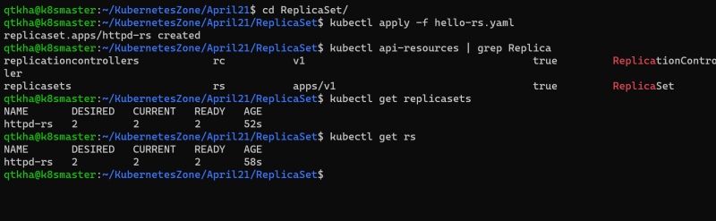

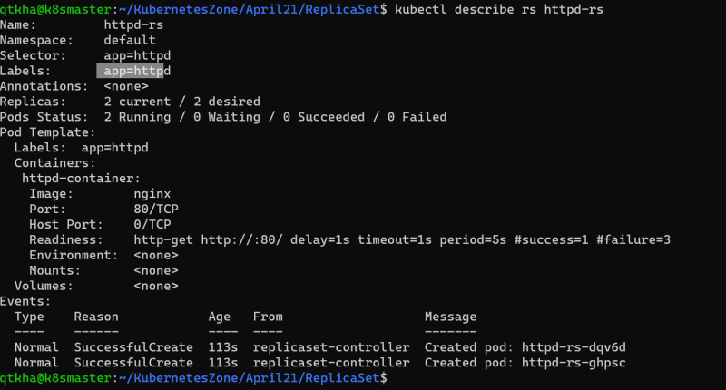

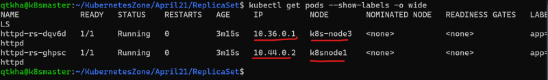

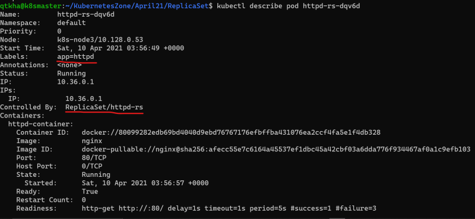

* lets delete one pod manually and see what happens

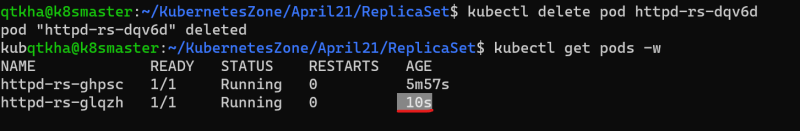

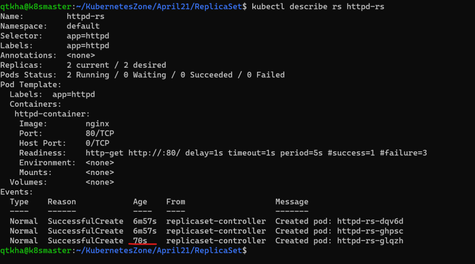

* Now lets try to delete the rs

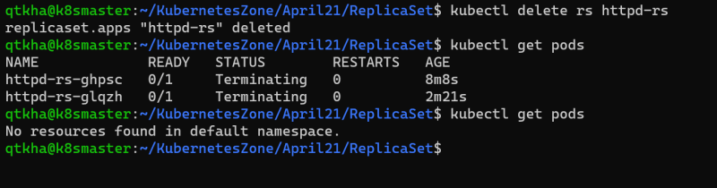

* Now lets create a pod with app: httpd label check manifest provided below

```yaml
---
apiVersion: v1
kind: Pod
metadata:
  name: label-demo1
  labels:
    environment: developer
    team: infra-ops
    project: qt-ecommerce
    app: httpd
spec:
  containers:
    - name: nginx-container
      image: nginx
      ports:
        - containerPort: 80
          protocol: TCP
```
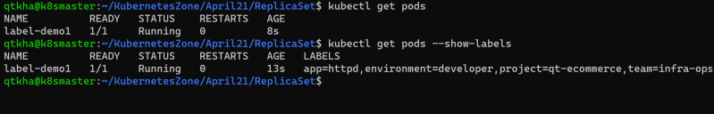
* Now lets apply the replica set which needs 2 replicas

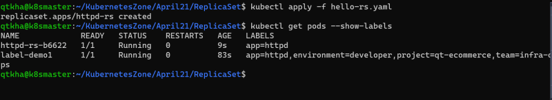

* replica set didnt create 2 pods rather it created one pod as there was one pod which matched the label selctor mentioned in replica set specification.

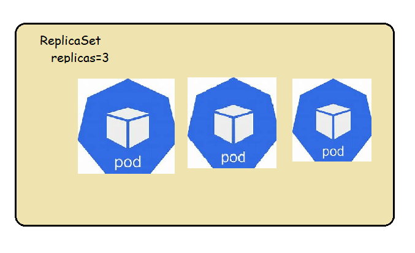

* Manually Scaling the replicas
   * change the spec
   * executing the command

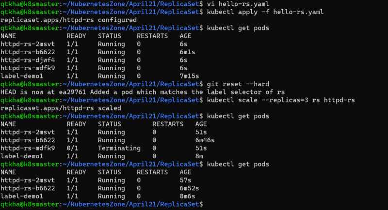

* Note: command to create token and display the join command in k8s custer

```
kubeadm token create --print-join-command --ttl=0
kubeadm token list
```
