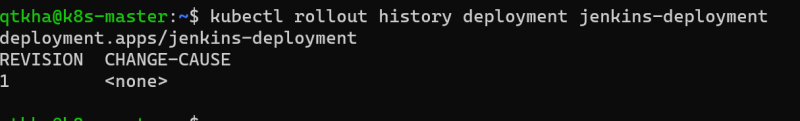

## Introducing the problem
* Consider we have replicaset where we deployed the application with 4 replicas


* Now when we get a new release from dev team, we build a new docker image and upload it to the docker hub or any private registry
* How can we apply the new image to replicaset?
    * one approach is to change the replicaset and apply new changes (new docker image) but this will have downtime
* We need a solution where we can apply the new docker images with replications without having downtime
* This can be achieved by kubernetes Deployment controller object

## Deployment
* A deployment is a k8s object that acts a wrapper around Replica Set and makes it easier to use.
* The major motivation for deployments is to maintain the history of revisions.
* Every time a change is made to the replica set or the underlying pods a new version of the ReplicaSet is recorded by Deployment. This way using a Deployment makes it easy to rollback to previous state or version
* Hierarchy of Deployment, ReplicaSet, Pods and container


* Strategy: In this strategy section we can define strategy to replace old pods with new ones when you are updating . There are two kinds of strategies
  * RollingUpdate
  * Recreate

* RollingUpdate:
    * We use this strategy to update deployment without having a downtime
    * In Rolling update we specify two important values
         * maxUnavailable: This is max number of Pods that can be unavailable during the update. default value for maxUnavailable is 25%
         * maxSurge: this is number of Pods that can be scheduled/created above the desired number of Pods. default value for maxSurge is 25%
    
* Recreate: In this strategy all the existing pods will be killed b4 creating new pods, so there will be some down time
* Lets create a simple deployment

```yaml
---
apiVersion: apps/v1
kind: Deployment
metadata:
  name: jenkins-deployment
  labels:
    app: jenkins
spec:
  replicas: 3
  minReadySeconds: 20
  selector:
    matchLabels:
      app: jenkins
      environment: production
  strategy:
    type: RollingUpdate
    rollingUpdate:
      maxSurge: 25%
      maxUnavailable: 25%
  template:
    metadata:
      labels:
        app: jenkins
        environment: production
        version: "1.6"
    spec:
      containers:
        - name: jenkins-container
          image: jenkins:1.651.1
          ports:
            - containerPort: 8080
              protocol: TCP
```
* Lets apply the template


* Labels and annotations on the deployment
    * k8s adds an annotation with the deployment.kubernetes.io/revision key which contains information about how many revisions have been there for particular deployment

    

* Added a simple service to access jenkins

```yaml
---
apiVersion: v1
kind: Service
metadata:
  name: jenkins-svc
spec:
  selector:
    app: jenkins
  type: NodePort
  ports:
    - port: 80
      protocol: TCP
      targetPort: 8080
```

* Now make some changes to simulate new application version

```yaml
---
apiVersion: apps/v1
kind: Deployment
metadata:
  name: jenkins-deployment
  labels:
    app: jenkins
spec:
  replicas: 3
  minReadySeconds: 20
  selector:
    matchLabels:
      app: jenkins
      environment: production
  strategy:
    type: RollingUpdate
    rollingUpdate:
      maxSurge: 25%
      maxUnavailable: 25%
  template:
    metadata:
      labels:
        app: jenkins
        environment: production
        version: "2.60"
    spec:
      containers:
        - name: jenkins-container
          image: jenkins:2.60.3
          ports:
            - containerPort: 8080
              protocol: TCP
```
* Now lets apply the changes using kubectl apply with –record flag. This flag esures that the the update to the deployment is recorded in the history of deployment


* Lets undo the deployment


## DaemonSets
* DaemonSets are used to manage the creation of particular pod on all or set of selected nodes in a cluster
* Use cases for DaemonSet
    * Logging: To manage running a log collection pod on all nodes and then process the logs in a log processing pipeline (sending logs to central logging server)
    * Local data caching
    * Monitoring
* Lets write one daemon set

```yaml
---
apiVersion: apps/v1
kind: DaemonSet
metadata:
  name: daemonset-demo
  labels:
    app: daemonset-example
spec:
  minReadySeconds: 10
  selector:
    matchLabels:
      app: daemon
  template:
    metadata:
      labels:
        app: daemon
        version: "1.0"
    spec:
      containers:
        - name: alpine
          image: alpine
          args:
            - /bin/sh
            - -c
            - sleep 1d
```
* lets apply the template


## Jobs
* A job is supervisor in k8s that can be used to manage pods to run some script/task and exit gracefully

* The pods created by the job arenot deleted following the completion of job. The pods run to completion and stay with a Completed status

* Lets create a k8s job configuration which will run the alpine pod to sleep for 2 minutes (sleep 2m) with restartPolicy OnFailure

```yaml
---
apiVersion: batch/v1
kind: Job
metadata:
  name: job-demo
spec:
  template:
    metadata:
      labels:
        app: jobdemo
    spec:
      containers:
        - name: dummyjob
          image: alpine
          args:
            - /bin/sh
            - -c
            - sleep 2m
      restartPolicy: OnFailure
```
* Lets apply the job template


* Exercise: Try to create a cron job spec which run every 15 minutes using same pod spec
