## Service Discovery
* So far we have learnt how to create Pods, Deployments and other controllers which help in deploying the containerized applications.
* We also have learnt each pods gets IP address.
* How can we connect to the applications running in the pods from external and also with in cluster.
* To help with this we have Kubernetes services. Services allows us to make logical set of pods discoverable and accessible for other pods running inside the cluster or to the external world

## Kubernetes Services
* Basic workflow

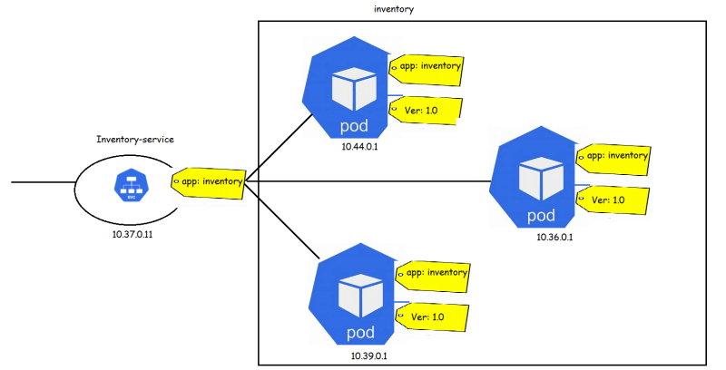

* Types of Services

   * NodePort: This type of services makes internal pods accesible on the port of the node on which pods are running
   * ClusterIp: This type of service exposes the Service on a certain ip address with in cluster
   * LoadBalancer: This type of Services exposes application externally using the load balancer provided by cloud provider
   * ExternalName: This type of service points to a DNS rather than set of pods

* Lets try to use the Jenkins Deployment [Refer Here](https://github.com/DevopsEasy/Kubernetes/blob/main/Deployment/JenkinsDeployment)
* The deployment can be represented as shown below

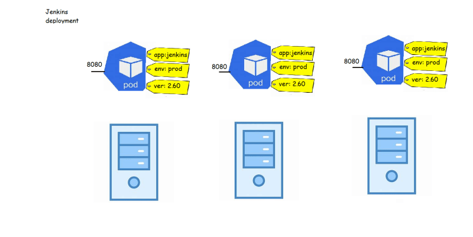

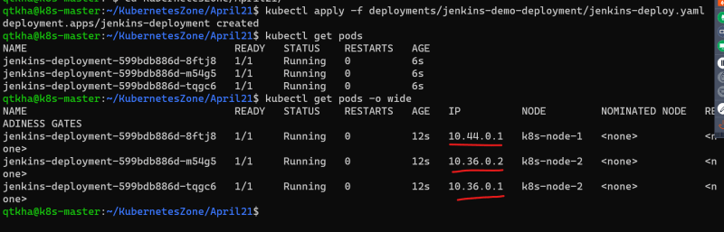

* Now lets try to create a jenkins service which exposes this application on some port of the node

* [Refer Here](https://github.com/DevopsEasy/Kubernetes/blob/main/Deployment/JenkinsDeployment/jenkins-service.yml) for the jenkins-service created

* Create a jenkins service

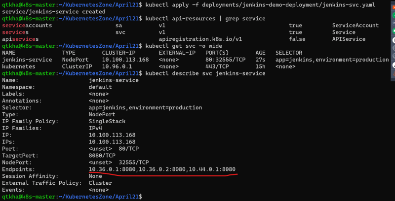

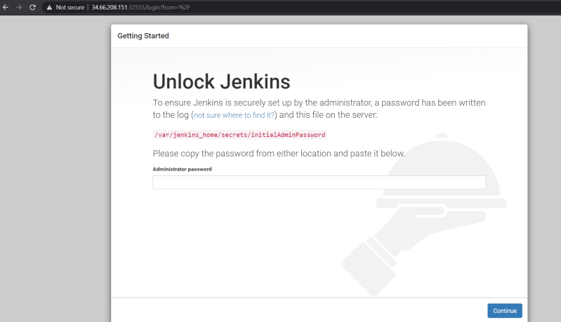

* Lets create one simple test pod to check certain things
* Check the template provided below and create the pod

```yaml
---
apiVersion: v1
kind: Pod
metadata:
  name: other-pod
spec: 
  containers:
    - name: alpine
      image: alpine
      args:
        - /bin/sh
        - -c
        - sleep 1d
```
* Now login into container and execute

* ``` curl http://ipaddressofsvc ```
* set to see environment variables
* Now lets create a deployment
  * of nginx containers and call it as frontend-deployment
  * of http containers and call it as middleware-deployment
  * of mysql container and call it as backend
  
  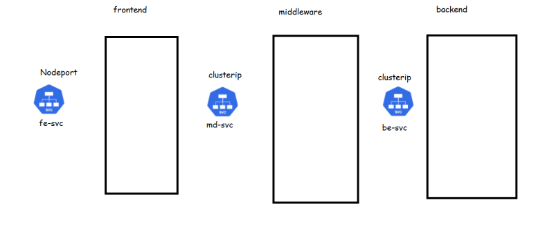

* Now lets add three service templates [Refer Here](https://github.com/DevopsEasy/Kubernetes/tree/main/Deployment/multideployment) for the changes

* apply the templates

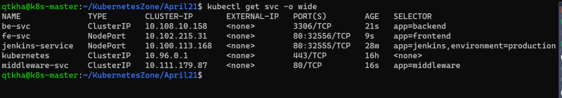

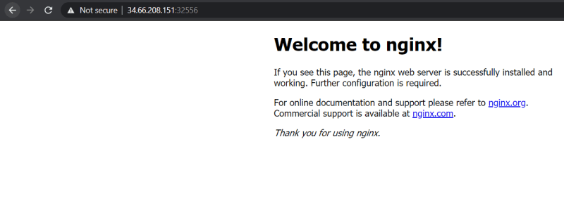

* Login into verification pod and try to access the mw-svc

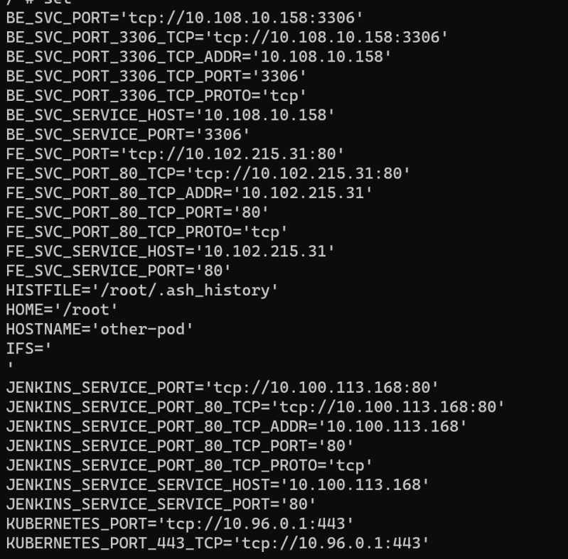

* Load balancer and ingress samples will be done with cloud providers

* [Refer Here](https://www.digitalocean.com/community/tutorials/an-introduction-to-haproxy-and-load-balancing-concepts) to understand differences layer 4 and layer 7 load balancing

## Kubernetes Volumes
* If the containers that store the data crashes and is restarted the data will be lost. The new container will start with empty disk space allocated
* Volume as a storage abstraction for pod applications

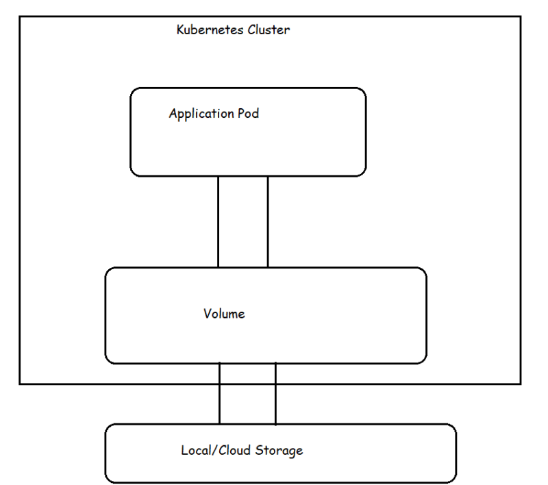

* Lifetime of k8s volume is same as pod that uses it.
* Even if the containers in the pod restart the same volume will be used by new container as well. Data will not be lost across container restarts, but when the pod is terminated or restart the volume ceases to exist (volume will be deleted)
* If you want to solve this problem of volumes getting deleted when pods get terminated then we need to use persistent volumes
* Types of volumes
    * Emptydir:
    * hostPath: this is used to mount a file or directory from the host node’s file system to a pod
    * There are other cloud based volumes [Refer Here](https://kubernetes.io/docs/concepts/storage/volumes/#volume-types)

* Lets try a sample pod with volume
* Check the manifest file provided below

```yaml
--
apiVersion: v1
kind: Pod
metadata:
  name: pod-with-emptydir-volume
spec:
  containers:
    - image: alpine
      name: alpine-container
      args:
       - /bin/sh
       - -c
       - sleep 1d
      volumeMounts:
        - mountPath: /data
          name: data-volume
        - mountPath: /var/log
          name: logs-volume
  volumes:
    - name: data-volume
      emptyDir: {}
    - name: logs-volume
      emptyDir: {}
```
* Lets create the pod

[Preview](./Images/k8s87.png)

[Preview](./Images/k8s88.png)

* Lets log in into this pod

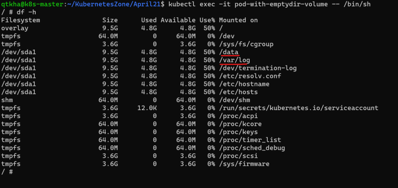

* Multiple containers sharing volumes
* See the manifest file provided below

```yaml
---
apiVersion: v1
kind: Pod
metadata:
  name: pod-with-multiple-volume
spec:
  containers:
    - image: alpine
      name: alpine1-container
      args:
       - /bin/sh
       - -c
       - sleep 60s
      volumeMounts:
        - mountPath: /data
          name: data-volume
        - mountPath: /var/log
          name: logs-volume
    - image: alpine
      name: alpine2-container
      args:
       - /bin/sh
       - -c
       - sleep 60s
      volumeMounts:
        - mountPath: /data
          name: data-volume
        - mountPath: /var/log
          name: logs-volume
    - image: ubuntu
      name: ubuntu-container
      args:
       - /bin/bash
       - -c
       - sleep 60s
      volumeMounts:
        - mountPath: /data
          name: data-volume
        - mountPath: /var/log
          name: logs-volume
  volumes:
    - name: data-volume
      emptyDir: {}
    - name: logs-volume
      hostPath:
        path: /var/log
```
## PersistentVolumes

* Kuberentes supports persistent storage in the form of Persistent Volume (PV).
* PV is a kubernetes object that represents block of storage in the cluster.
* This can be either be provisioned beforehand by the admins or we can dynamically provision
* A PV is a cluster resource. Lifecycle of PV doesn’t depend on lifecycle of pod.
* In order to use a PV, a PersistentVolumeClaim (PVC) needs to be created.
* A PVC is a request to the storage by the user or pod.
* PVC can request specific size of storage and specific access mode
* PVC are scoped by namespace
* How PV and PVC work together to provide the storage to application pod 

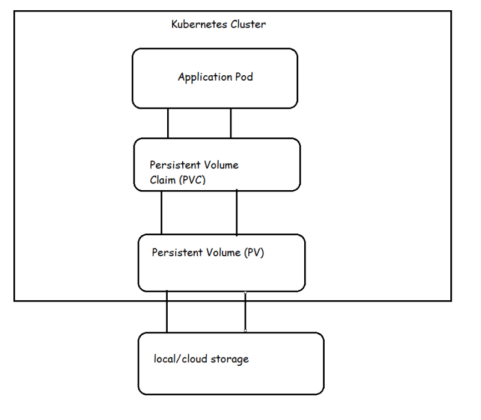

* k8s supports different types of PersistentVolumes [Refer Here](https://kubernetes.io/docs/concepts/storage/persistent-volumes/#types-of-persistent-volumes)
* Each PV belongs to certain storage class.
* Persistent Volume Reclaim policy
    * Retain
    * Recycle
    * Delete
* PV Status
   * Available
   * Bound
   * Released
   * Failed
* Access Modes [Refer Here](https://kubernetes.io/docs/concepts/storage/persistent-volumes/#access-modes)
* [Refer Here](https://github.com/DevopsEasy/Kubernetes/tree/main/Deployment/PersistentVolume/hello-pv) for the sample configuration

## Next topics
* ConfigMap and Secrets
* Azure Kubernetes Services
* Elastic Kubernetes Services
* Google Compute Engine
